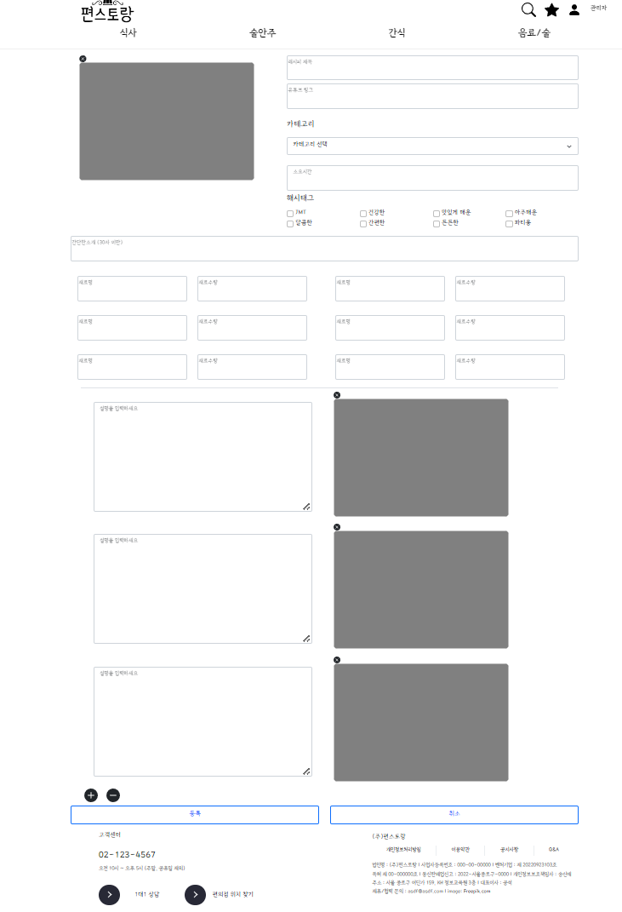
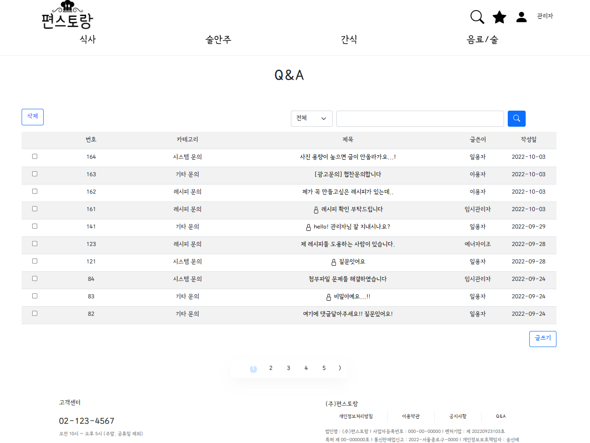
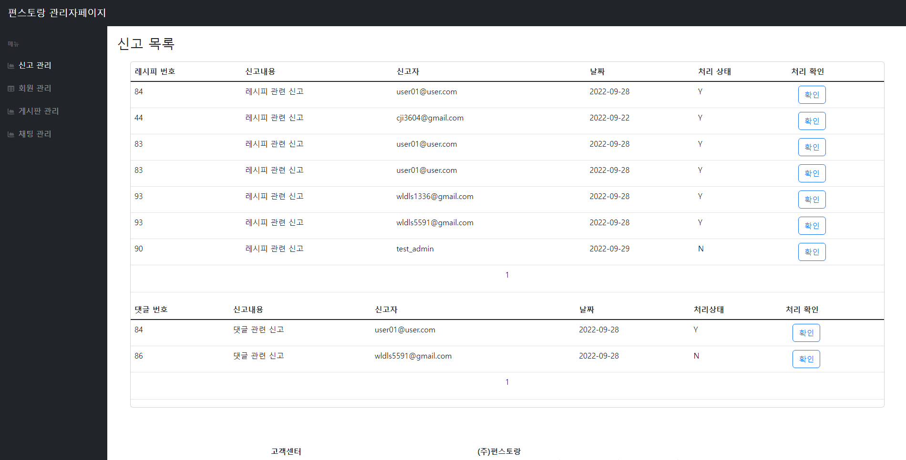

<h1 align="center">편스토랑에 오신 것을 환영합니다 :)</h1>

<p align="center">
  
<p>

## :film_projector: [웹버전 시연영상](https://youtu.be/21dfU2m0mz4) :iphone: [모바일버전 시연영상](https://youtu.be/ek9YBXw9iXo) :loudspeaker:[기획보고서](https://drive.google.com/file/d/1tgI4TGPzVjk94w7uZH6swSkuV7SN0593/view?usp=sharing)


## :convenience_store: 프로젝트 소개
```
편스토랑은 바쁜 현대 사회에서 어디에나 존재하는 편의점의 음식들을 활용해 요알못도 
할 수 있는 쉬운 요리 레시피를 공유하는 사이트 입니다.
```


## 📅 개발 기간
```
2022.9.15 ~ 2022.9.28
```


## 🧑‍🤝‍🧑 멤버 구성
**천지인**/ _로그인&로그아웃, 회원가입, 마이페이지_

**남하나**/ _레시피 게시판, Q&A 게시판_

**신은정**/ _채팅 상담, 검색_

**이혁렬**/ _공지사항 게시판, 마이레시피_

**한재민**/ _관리자 페이지_


## 🧰 개발 환경
<p align="center">
  
<p>


## ⚙️ 기술 스택
<p align="center">
  
<p>


## 🔨 주요 기능 및 상세

|기능|상세|
|:--:|:--:|
|로그인|세션을 이용하여 로그인 구현, AdminCheck(Boolean) 값을 이용해 관리자와 회원 구분|
|회원가입|Ajax와 JavaMailSender를 활용하여 이메일 인증, JS를 이용해 비밀번호 확인, 인증번호 확인 구현 |
|마이페이지|회원정보 조회, 회원정보 수정, 내가 쓴 레시피 조회, 내가 쓴 댓글 조회, 포인트 이력 조회, 회원 탈퇴, 로그아웃 구현 |
|마이레시피|여기에 해당 기능 설명을 적어주시면 됩니다! 여기에 해당 기능 설명을 적어주시면 됩니다! 여기에 해당 기능 설명을 적어주시면 됩니다!2|
|레시피 게시판| 사진과 재료 순서 등을 적어 추가할수 있는 레시피 등록 기능 구현, 유튜브 주소 입력시 해당 유튜브 동영상을 출력할수 있도록 설계, javascript로 첨부파일의 유효성을 체크하여 그림파일만 첨부 가능하도록 설계 spring을 활용하여 대표사진, 과정사진 등을 배열로 받아 여러개의 테이블의 저장하고 다시 테이블들을 불러와 레시피를 출력할수 있도록 함, 같은 방식으로 레시피의 수정이 가능하며, 삭제, 댓글기능을 포함함. 세션을 활용하여 로그인체크와 작성자 확인을 하여 이용자가 권한에 따라 레시피 기능에 접근 가능하도록 설계|
|Q&A 게시판| 게시물의 등록, 수정, 삭제, 댓글기능 javascript로 첨부파일의 유효성을 체크하여 그림파일만 첨부 가능하도록 설계 spring을 활용하여 첨부파일을 배열로 받아 출력함, 세션의  adminCheck를 활용하여 관리자만 댓글을 등록가능하며 작성자가 비밀글로 등록했을 시 세션을 활용하여 작성자와 현재 로그인한 아이디가 일치할 경우와 adminCheck로 관리자만 비밀글을 열람가능하도록 구현, 제목과 내용을 활용한 검색기능 구현|
|공지사항 게시판| 관리자가 공지사항의 글을 수정 등록할 수 있도록 설계. 일반유저는 조회만 가
|검색|레시피를 식사, 간식, 술안주, 술/음료 순으로 분류하고 조회순, 추천순, 등록일 순으로 분류합니다. 추가로 제목명, 재료명, 해시태그순으로 2차 분류|
|상담|실시간 채팅으로 관리자와 운영관리 상담구현|
|관리자 페이지| 관리자가 회원의탈퇴와 포인트를 관리하고, 게시판조회와 댓글 게시판 신고를 관리.

### 1. 로그인
<p align="center">
  
<p>
<br>

### 2. 회원가입
<p align="center">
  
<p>
<br>

### 3. 마이페이지
<p align="center">
  
<p>

<p align="center">
  
<p>

<p align="center">
  
<p>

<p align="center">
  
<p>
<br>

### 4. 마이레시피

### 5. 레시피 게시판
<p align="center">

</p>

### 6. 레시피 상세 페이지
<p align="center">

</p>

<p align="center">

</p>

<p align="center">

</p>


### 7. Q&A 게시판
<p align="center">

</p>

<p align="center">

</p>

<p align="center">

</p>

<p align="center">

</p>

### 8. 공지사항 게시판

<p align="center">

</p>

<p align="center">

</p>

<p align="center">

</p>

### 9. 채팅 상담
<p align="center">

</p>
<p>

</p>

### 10. 검색
<p align="center">

</p>

### 11. 관리자 페이지
<p align="center">

</p>

<p align="center">

</p>

<p align="center">

</p>

## 🏆 수상 이력


<!--Readme 참고 사이트-->
<!--https://github.com/n0hack/readme-template/blob/main/README.md-->
<!--https://github.com/n0hack/readme-template-->
